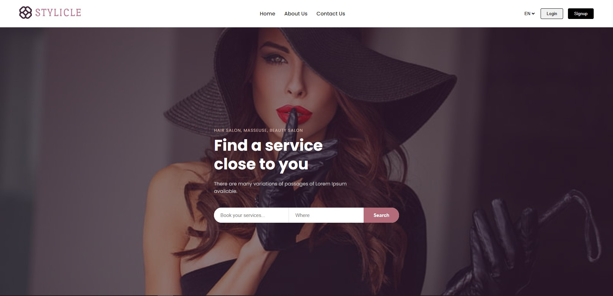

# Beauty Salon Monorepo | Laravel + Vue



[Other Screenhots](./screenshots/)

[Design](https://www.figma.com/design/yUBTU3YSEETOeeHubgtoBS/%D1%81%D0%B0%D0%BB%D0%BE%D0%BD-%D0%BA%D1%80%D0%B0%D1%81%D0%BE%D1%82%D1%8B?node-id=1-656&t=l98qR9PPTmpH9UVy-1)

---

## Project Structure

```
beautysalon/
  apps/
    client/ # Vue Frontend
    serveer-inertia/ # Laravel + Vue
  legacy/ # Vanilla PHP
  package.json
  pnpm-workspace.yaml
  turbo.json
  tsconfig.json
  pnpm-lock.yaml
```

---

## Running and building locally

### All projects at once

```bash
pnpm dev        # runs all dev servers in parallel
pnpm build      # builds everything
```

### One project

```bash
pnpm turbo run dev --filter=astro-app
pnpm turbo run build --filter=next-app
```

Check the list of available projects:

```bash
pnpm list -r
```

---

## Tech Stack

<p align="left">
  
  
  
  
</p>
